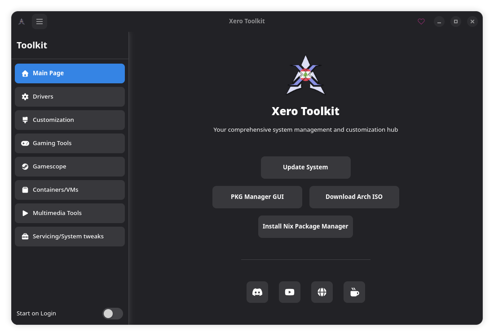
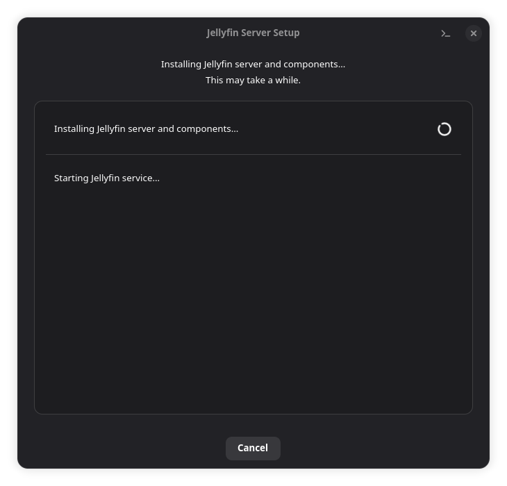
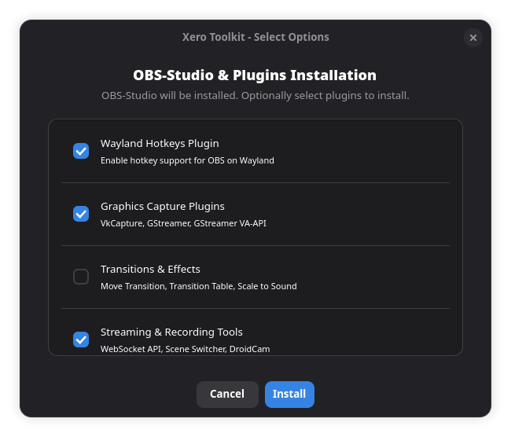

# 🛠️ XeroLinux Toolkit

A comprehensive GTK4 GUI application for managing system tools, configurations, and customizations on XeroLinux systems.

## 📸 Screenshots

*Main application window*

*Real-time progress tracking during package installation*

*Multi-select interface for choosing tools and applications to install*

## 🎯 What It Does

This tool lets you easily manage and customize your XeroLinux system through a clean, modern interface. You can:

- **Update your system** with a single click
- **Install package managers** - Octopi, Bauh, Warehouse, Flatseal, and more
- **Set up drivers** - GPU drivers (NVIDIA, AMD), Tailscale VPN, ASUS ROG tools
- **Configure gaming** - Steam with dependencies, Lutris, Heroic, Bottles, Gamescope
- **Customize your desktop** - ZSH setup, GRUB themes, Plymouth, desktop themes
- **Manage containers & VMs** - Docker, Podman, VirtualBox, DistroBox, KVM/QEMU
- **Install multimedia tools** - OBS Studio, Jellyfin, and more
- **Service your system** - Clear caches, fix keyrings, update mirrors

## ⚙️ How It Works

The application is split into two parts:

- **GUI Application**: The main interface you interact with for managing your system
- **Authentication Daemon**: Handles privileged operations that require admin rights

When you install packages or run system operations, you'll see live updates showing your progress:
- Real-time command output with colored terminal feedback
- Progress indicators for installations
- And helpful error messages if something needs attention

## ✨ Features

- **Tabbed navigation** with organized categories
- **Smart dependency detection** - shows which packages are already installed
- **Multi-select installations** - install related tools together
- **AUR helper support** - works with Paru or Yay
- **Flatpak integration** - manage both native and Flatpak packages
- **Modern GTK4 interface** that fits naturally in your desktop

## 💻 System Requirements

- **XeroLinux** (specifically designed for XeroLinux)
- **AUR Helper** - Paru or Yay (required for most features)
- **Flatpak** - optional but recommended

This tool is specifically designed for **XeroLinux only** and will not work on other Linux distributions.

## 📄 License

This project is licensed under the GNU General Public License v3.0 - see the [LICENSE](LICENSE) file for details.

